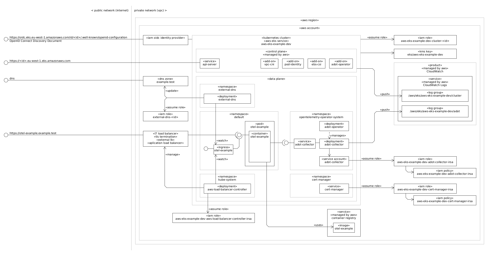

# About

[](https://github.com/rgl/terramate-aws-eks-example/actions/workflows/lint.yml)

This creates an example kubernetes cluster hosted in the [AWS Elastic Kubernetes Service (EKS)](https://aws.amazon.com/eks/) using a Terramate project with Terraform.

This will:

* Create an Elastic Kubernetes Service (EKS)-based Kubernetes cluster.
  * Enable the [VPC CNI cluster add-on](https://docs.aws.amazon.com/eks/latest/userguide/managing-vpc-cni.html).
  * Enable the [AWS Distro for OpenTelemetry (ADOT) Operator add-on](https://docs.aws.amazon.com/eks/latest/userguide/opentelemetry.html).
  * Create the [AWS Distro for OpenTelemetry (ADOT) Collector Deployment and `adot-collector` Service](https://aws-otel.github.io).
    * Forwarding OpenTelemetry telemetry signals to [Amazon CloudWatch](https://aws.amazon.com/cloudwatch/).
* Create the Elastic Container Registry (ECR) repositories declared on the
  [`source_images` global variable](config.tm.hcl), and upload the corresponding container
  images.
* Demonstrate how to automatically deploy the [`kubernetes-hello` workload](stacks/eks-workloads/kubernetes-hello.tf).
  * Show its environment variables.
  * Show its tokens, secrets, and configs (config maps).
  * Show its pod name and namespace.
  * Show the containers running inside its pod.
  * Show its memory limits.
  * Show its cgroups.
  * Expose as a Kubernetes `Ingress`.
    * Note that this results in the creation of an [EC2 Application Load Balancer (ALB)](https://docs.aws.amazon.com/elasticloadbalancing/latest/application/introduction.html).
  * Use [Role and RoleBinding](https://kubernetes.io/docs/reference/access-authn-authz/rbac/).
  * Use [ConfigMap](https://kubernetes.io/docs/concepts/configuration/configmap/).
  * Use [Secret](https://kubernetes.io/docs/concepts/configuration/secret/).
  * Use [ServiceAccount](https://kubernetes.io/docs/concepts/security/service-accounts/).
  * Use [Service Account token volume projection (a JSON Web Token and OpenID Connect (OIDC) ID Token)](https://kubernetes.io/docs/tasks/configure-pod-container/configure-service-account/#serviceaccount-token-volume-projection) for the `https://example.com` audience.
* Demonstrate how to automatically deploy the [`otel-example` workload](stacks/eks-workloads/otel-example.tf).
  * Expose as a Kubernetes `Ingress` `Service`.
    * Note that this results in the creation of an [EC2 Application Load Balancer (ALB)](https://docs.aws.amazon.com/elasticloadbalancing/latest/application/introduction.html).
  * Send OpenTelemetry telemetry signals to the [`adot-collector` service](stacks/eks/adot-collector/main.tf).
    * Send the logs telemetry signal to the Amazon CloudWatch Logs service.

The main components are:



For equivalent example see:

* [terraform-aws-eks-example](https://github.com/rgl/terraform-aws-eks-example)

# Usage (on a Ubuntu Desktop)

Install the dependencies:

* [AWS CLI](https://docs.aws.amazon.com/cli/latest/userguide/getting-started-install.html).
* [Terraform](https://www.terraform.io/downloads.html).
* [Terramate](https://terramate.io/docs/cli/installation).
* [Crane](https://github.com/google/go-containerregistry/releases).
* [Docker](https://docs.docker.com/engine/install/).

Set the AWS Account credentials using SSO:

```bash
# set the environment variables to use a specific profile.
# e.g. use the pattern <aws-sso-session-name>-<aws-account-name>-<aws-account-role>-<aws-account-id>
export AWS_PROFILE=example-dev-AdministratorAccess-123456
unset AWS_ACCESS_KEY_ID
unset AWS_SECRET_ACCESS_KEY
unset AWS_DEFAULT_REGION
# set the account credentials.
# see https://docs.aws.amazon.com/cli/latest/userguide/sso-configure-profile-token.html#sso-configure-profile-token-auto-sso
aws configure sso
# dump the configured profile and sso-session.
cat ~/.aws/config
# show the user, user amazon resource name (arn), and the account id, of the
# profile set in the AWS_PROFILE environment variable.
aws sts get-caller-identity
```

Or, set the AWS Account credentials using an Access Key:

```bash
# set the account credentials.
# NB get these from your aws account iam console.
#    see Managing access keys (console) at
#        https://docs.aws.amazon.com/IAM/latest/UserGuide/id_credentials_access-keys.html#Using_CreateAccessKey
export AWS_ACCESS_KEY_ID='TODO'
export AWS_SECRET_ACCESS_KEY='TODO'
unset AWS_PROFILE
# set the default region.
export AWS_DEFAULT_REGION='eu-west-1'
# show the user, user amazon resource name (arn), and the account id.
aws sts get-caller-identity
```

Review the [`config.tm.hcl`](config.tm.hcl) file.

Initialize the project:

```bash
terramate run terraform init -lockfile=readonly
terramate run terraform validate
```

Launch the example:

```bash
terramate run terraform apply
```

Show the terraform state:

```bash
terramate run terraform state list
terramate run terraform show
```

Show the [OpenID Connect Discovery Document](https://openid.net/specs/openid-connect-discovery-1_0.html) (aka OpenID Connect Configuration):

```bash
wget -qO- "$(
  terramate run -C stacks/eks-workloads \
    terraform output -raw cluster_oidc_configuration_url)" \
  | jq
```

**NB** The Kubernetes Service Account tokens are JSON Web Tokens (JWT) signed
by the cluster OIDC provider. They can be validated using the metadata at the
`cluster_oidc_configuration_url` endpoint. You can view a Service Account token
at the installed `kubernetes-hello` service endpoint.

Get the cluster `kubeconfig.yml` configuration file:

```bash
export KUBECONFIG="$PWD/kubeconfig.yml"
rm "$KUBECONFIG"
aws eks update-kubeconfig \
  --region "$(terramate run -C stacks/eks-workloads terraform output -raw region)" \
  --name "$(terramate run -C stacks/eks-workloads terraform output -raw cluster_name)"
```

Access the EKS cluster:

```bash
export KUBECONFIG="$PWD/kubeconfig.yml"
kubectl cluster-info
kubectl get nodes -o wide
```

List the installed Helm chart releases:

```bash
helm list --all-namespaces
```

Show the rendered `cert-manager` Helm chart:

```bash
helm get -n cert-manager manifest cert-manager
```

Show the `adot` OpenTelemetryCollector instance:

```bash
kubectl get -n opentelemetry-operator-system opentelemetrycollector/adot -o yaml
```

Access the `otel-example` ClusterIP Service from a [kubectl port-forward local port](https://kubernetes.io/docs/tasks/access-application-cluster/port-forward-access-application-cluster/):

```bash
kubectl port-forward service/otel-example 6789:80 &
sleep 3 && printf '\n\n'
wget -qO- http://localhost:6789/quote | jq
kill %1 && sleep 3
```

Access the `otel-example` Ingress from the Internet:

```bash
otel_example_address="$(kubectl get ingress/otel-example -o jsonpath='{.status.loadBalancer.ingress[0].hostname}')"
otel_example_host="$(kubectl get ingress/otel-example -o jsonpath='{.spec.rules[0].host}')"
otel_example_url="http://$otel_example_address"
echo "otel-example ingress address: $otel_example_address"
echo "otel-example ingress host: $otel_example_host"
# wait for the address to resolve.
while [ -z "$(dig +short "$otel_example_address")" ]; do sleep 5; done && dig "$otel_example_address"
# finally, access the service.
wget -qO- --header "Host:$otel_example_host" "$otel_example_url/quote" | jq
```

Access the `kubernetes-hello` ClusterIP Service from a [kubectl port-forward local port](https://kubernetes.io/docs/tasks/access-application-cluster/port-forward-access-application-cluster/):

```bash
kubectl port-forward service/kubernetes-hello 6789:80 &
sleep 3 && printf '\n\n'
wget -qO- http://localhost:6789
kill %1 && sleep 3
```

Access the `kubernetes-hello` Ingress from the Internet:

```bash
kubernetes_hello_address="$(kubectl get ingress/kubernetes-hello -o jsonpath='{.status.loadBalancer.ingress[0].hostname}')"
kubernetes_hello_host="$(kubectl get ingress/kubernetes-hello -o jsonpath='{.spec.rules[0].host}')"
kubernetes_hello_url="http://$kubernetes_hello_address"
echo "kubernetes-hello ingress domain: $kubernetes_hello_address"
echo "kubernetes-hello ingress host: $kubernetes_hello_host"
# wait for the address to resolve.
while [ -z "$(dig +short "$kubernetes_hello_address")" ]; do sleep 5; done && dig "$kubernetes_hello_address"
# finally, access the service.
wget -qO- --header "Host:$kubernetes_hello_host" "$kubernetes_hello_url"
```

Log in the container registry:

**NB** You are logging in at the registry level. You are not logging in at the
repository level.

```bash
aws ecr get-login-password \
  --region "$(terramate run -C stacks/ecr terraform output -raw registry_region)" \
  | docker login \
      --username AWS \
      --password-stdin \
      "$(terramate run -C stacks/ecr terraform output -raw registry_domain)"
```

**NB** This saves the credentials in the `~/.docker/config.json` local file.

Inspect the created example container image:

```bash
image="$(terramate run -C stacks/ecr terraform output -json images | jq -r '."otel-example"')"
echo "image: $image"
crane manifest "$image" | jq .
```

Download the created example container image from the created container image
repository, and execute it locally:

```bash
docker run --rm "$image"
```

Delete the local copy of the created container image:

```bash
docker rmi "$image"
```

Log out the container registry:

```bash
docker logout \
  "$(terramate run -C stacks/ecr terraform output -raw registry_domain)"
```

Delete the example image resource:

```bash
terramate run -C stacks/ecr \
  terraform destroy -target='terraform_data.ecr_image["otel-example"]'
```

At the ECR AWS Management Console, verify that the example image no longer
exists (actually, it's the image index/tag that no longer exists).

Do an `terraform apply` to verify that it recreates the example image:

```bash
terramate run terraform apply
```

Destroy the example:

```bash
terramate run --reverse terraform destroy
```

**NB** For some unknown reason, terraform shows the following Warning message. If you known how to fix it, please let me known!

```
╷
│ Warning: EC2 Default Network ACL (acl-004fd900909c20039) not deleted, removing from state
│
│
╵
```

List this repository dependencies (and which have newer versions):

```bash
GITHUB_COM_TOKEN='YOUR_GITHUB_PERSONAL_TOKEN' ./renovate.sh
```

# Caveats

* After `terraform destroy`, the following resources will still remain in AWS:
  * KMS Kubernetes cluster encryption key.
    * It will be automatically deleted after 30 days (the default value
      of the `kms_key_deletion_window_in_days` eks module property).
  * CloudWatch log groups.
    * These will be automatically deleted after 90 days (the default value
      of the `cloudwatch_log_group_retention_in_days` eks module property)
* When running `terraform destroy`, the current user (aka the cluster creator)
  is eagerly removed from the cluster, which means, when there are problems, we
  are not able to continue or troubleshoot without manually granting our role
  the `AmazonEKSClusterAdminPolicy` access policy. For example, when using SSO
  roles, we need to add an IAM access entry like:

  | Property          | Value                                                                                                                   |
  |-------------------|-------------------------------------------------------------------------------------------------------------------------|
  | IAM principal ARN | `arn:aws:iam::123456:role/aws-reserved/sso.amazonaws.com/eu-west-1/AWSReservedSSO_AdministratorAccess_0000000000000000` |
  | Type              | `Standard`                                                                                                              |
  | Username          | `arn:aws:sts::123456:assumed-role/AWSReservedSSO_AdministratorAccess_0000000000000000/{{SessionName}}`                  |
  | Access policies   | `AmazonEKSClusterAdminPolicy`                                                                                           |

  You can list the current access entries with:

  ```bash
  aws eks list-access-entries \
    --cluster-name "$(
      terramate run -C stacks/eks-workloads \
        terraform output -raw cluster_name)"
  ```

  Which should include the above `IAM principal ARN` value.

# Notes

* Its not possible to create multiple container image registries.
  * A single registry is automatically created when the AWS Account is created.
  * You have to create a separate repository for each of your container images.
    * A repository name can include several path segments (e.g. `hello/world`).
* Terramate does not support flowing Terraform outputs into other Terraform
  program input variables. Instead, Terraform programs should use Terraform
  data sources to find the resources that are already created. Those resources
  should be found by their metadata (e.g. name) defined in a Terramate global.
  * See https://github.com/terramate-io/terramate/discussions/525
  * See https://github.com/terramate-io/terramate/discussions/571#discussioncomment-3542867
  * See https://github.com/terramate-io/terramate/discussions/1090#discussioncomment-6659130
* OpenID Connect Provider for EKS (aka [Enable IAM Roles for Service Accounts (IRSA)](https://docs.aws.amazon.com/emr/latest/EMR-on-EKS-DevelopmentGuide/setting-up-enable-IAM.html)) is enabled.
  * a [aws_iam_openid_connect_provider resource](https://registry.terraform.io/providers/hashicorp/aws/latest/docs/resources/iam_openid_connect_provider) is created.
* The EKS nodes virtual machines boot from a customizable Amazon Machine Image (AMI).
  * This example uses the Amazon Linux 2 AMI.
  * The official AMIs source code is available at the [Amazon EKS AMI awslabs/amazon-eks-ami repository](https://github.com/awslabs/amazon-eks-ami).

# References

* [Environment variables to configure the AWS CLI](https://docs.aws.amazon.com/cli/latest/userguide/cli-configure-envvars.html)
* [Token provider configuration with automatic authentication refresh for AWS IAM Identity Center](https://docs.aws.amazon.com/cli/latest/userguide/sso-configure-profile-token.html) (SSO)
* [Managing access keys (console)](https://docs.aws.amazon.com/IAM/latest/UserGuide/id_credentials_access-keys.html#Using_CreateAccessKey)
* [AWS General Reference](https://docs.aws.amazon.com/general/latest/gr/Welcome.html)
  * [Amazon Resource Names (ARNs)](https://docs.aws.amazon.com/general/latest/gr/aws-arns-and-namespaces.html)
* [Amazon ECR private registry](https://docs.aws.amazon.com/AmazonECR/latest/userguide/Registries.html)
  * [Private registry authentication](https://docs.aws.amazon.com/AmazonECR/latest/userguide/registry_auth.html)
* [Network load balancing on Amazon EKS](https://docs.aws.amazon.com/eks/latest/userguide/network-load-balancing.html)
* [Amazon EKS add-ons](https://docs.aws.amazon.com/eks/latest/userguide/eks-add-ons.html)
* [Amazon EKS VPC-CNI](https://github.com/aws/amazon-vpc-cni-k8s)
* [EKS Workshop](https://www.eksworkshop.com)
  * [Using Terraform](https://www.eksworkshop.com/docs/introduction/setup/your-account/using-terraform)
    * [aws-samples/eks-workshop-v2 example repository](https://github.com/aws-samples/eks-workshop-v2/tree/main/cluster/terraform)
* [Official Amazon EKS AMI awslabs/amazon-eks-ami repository](https://github.com/awslabs/amazon-eks-ami)
* [terramate-quickstart-aws](https://github.com/terramate-io/terramate-quickstart-aws)
* [aws-ia/terraform-aws-eks-blueprints](https://github.com/aws-ia/terraform-aws-eks-blueprints)
* [aws-ia/terraform-aws-eks-blueprints-addons](https://github.com/aws-ia/terraform-aws-eks-blueprints-addons)
* [aws-ia/terraform-aws-eks-blueprints-addon](https://github.com/aws-ia/terraform-aws-eks-blueprints-addon)
